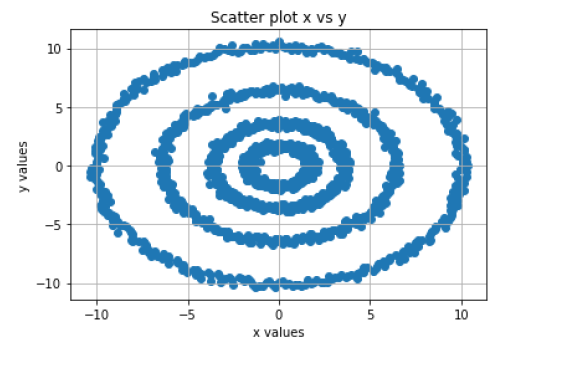
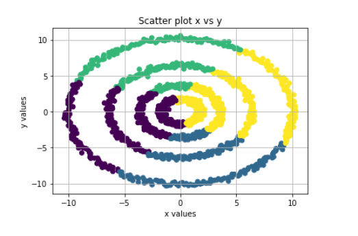
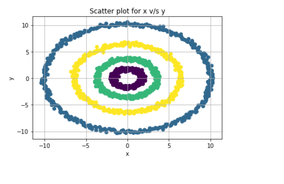

# Spiral_clustering_Machine-Learning

- Provides a study on typical use case of spiral clustering

- Upon perform the easiest clustering technique the KNN we could see below the clustering plot and we know that is not correct. 

- And finally after perform the matrix transformations on the dataset and we could see the proper clustering.

